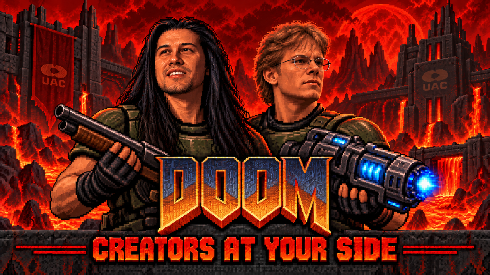

# Creators at Your Side - Companion Mod



A Doom II companion mod for UZDoom/GZDoom, featuring John Romero, John Carmack, Jay Wilbur, Tom Hall, and Young Adrian Carmack, selectable skins, voices, independent kill tallies, a companion control panel, and a torch-lit Hell titlemap.

## Play

Load `dist/Romero_Carmack_Companion_Control.pk3` with your own Doom II IWAD. Load only this companion package, not older versions alongside it. Tested with UZDoom 4.14.3. Restart the engine after updating the package.

## Controls

| Key | Action |
| --- | --- |
| F8 | Open Companion Control; also available through the Companions main-menu entry. |
| F7 | Release all camp orders and switch Normal / Close following. Press again to switch back. |
| K | Hold to aim Romero’s camp circle; release to teleport and camp. |
| J | Hold to aim Jay Wilbur's camp circle; release to teleport and camp. |
| L | Hold to aim Carmack’s camp circle; release to teleport and camp. |

Each companion has a separate **10-second cooldown**. Pressing them again never releases camping: after the cooldown, it relocates that companion’s camp. Aim at clear ground within 1024 map units. A green circle shows a valid landing; red means blocked or cooling down. The companion lands at the circle’s center. Invalid placements do not consume the cooldown. F7 also cancels a held placement. Bottom-screen messages confirm orders or show the remaining cooldown. Keys can be rebound in Customize Controls under Companion controls; existing bindings take precedence over defaults.

Campers wander slightly around their individual spots and use ranged attacks without pursuing enemies. Close following also keeps them with the player during combat. Normal retains the original movement behavior. Camp spots belong to the current level.

## Skins

- Romero: Present-day, Daikatana era, John Romero 2005.

- Carmack: Young Carmack, John Carmack 2006, **SwoleMack**.

Select skins independently and choose any one character or any pair. Maximum two companions, chosen from Romero, John Carmack, Jay, Tom and Adrian; all ten pairings are supported. K and L follow roster order (Romero, John Carmack, Jay, Tom, Adrian), and their current names appear at the bottom of the menu. SwoleMack features short silver hair, glasses, a black T-shirt, and stronger arms. Skins include directional walking, shooting, pain, and non-bloody falling frames. All five characters appear in the title scene with ENABLED or DISABLED beneath them. Only selected companions appear in gameplay, the HUD and level tally. Jay has his own striped rugby-shirt sprite set, animated HUD portrait, and forward-looking tally portrait. His nickname is Bizz Guy; no borrowed Romero/Carmack voice lines play for him.

Tom has Young and Present-day skins, selected with Change Skin on his card. Young Tom wears a cream overshirt over a black shirt; present-day Tom is bald with black glasses, a white beard, and a patterned black shirt. Jay and young Tom retain their full 1254-pixel portrait artwork rather than downsampled thumbnails. Both Tom skins have matching portraits that animate in the HUD; the forward-looking portrait appears on the tally. He has no borrowed voice recordings.

## Build

Python 3 is sufficient; no extra packages are required:

```sh

python tools/build.py

```

`mod/` is the complete editable source of the released PK3, including scripts, sprite definitions, graphics, and audio. The build packages it into `dist/Romero_Carmack_Companion_Control.pk3`.

## Validation

The in-engine checks in `tests/aim-test.zs` verify hold/release behavior, exact marker placement, and cooldown rejection. Previous camp checks verified teleport placement, independent cooldowns, blocked repeat presses, relocation after 10 seconds, releasing both camps, and successive F7 toggles. Earlier checks verified ranged close combat and SwoleMack in solo and duo configurations. The build also verifies archive integrity.

## Assets and attribution

This project extends the supplied John Romero companion mod and preserves its bundled credits and resources in `mod/`. Sprite variants were generated using supplied reference photographs and then extracted and registered as Doom sprites. The SwoleMack generation prompt is in `art/SwoleMack-generation-prompt.txt`. The companion panel uses TINYBABY lettering and a blue/cyan style adapted from the Doom Cleanup Sim project. Carmack dialogue uses the interview clips supplied for this mod. Doom II game data and engine binaries are not included. No blanket license is asserted over third-party assets.

If updating from the old instant camp bindings, rebind the two camp commands in Customize Controls to enable hold/release.

## TuinDoomRPG compatibility

Load `TuinRPG.pk3` first, followed by `Romero_Carmack_Companion_Control.pk3`. A green **TUIN RPG DETECTED - COMPATIBILITY ACTIVE** message confirms detection. The companion titlemap skips the RPG's per-level gameplay/HUD handlers so the mandatory class chooser does not open in the decorative title scene. The engine recreates those handlers normally on a real map; class selection and gameplay remain active. No TuinDoomRPG files are modified. Verified with the supplied TuinRPG package in UZDoom 4.14.3.

## Companion chat

Optional top-left text banter includes 150 original fictional lines (not real quotes), tailored to Romero, John Carmack and Jay, enemy type, and weapon. Toggle **Chat** in Companion Control. Regular kills have a 12% chance to request a line; boss kills 85%, always subject to a shared 30-50 second cooldown and a 75-second per-character cooldown. Idle/camp chatter waits 90-150 seconds after a line. One message appears for seven seconds, with no queue of delayed kill reactions. Voice clips already playing defer chatter. Enemy-specific dialogue recognizes vanilla classes and subclasses; other monsters use generic or boss lines.

Persona research and dialogue attribution: [BANTER-SOURCES.md](mod/BANTER-SOURCES.md).

Jay asset extraction scripts use Pillow and NumPy; the ordinary PK3 build still only requires Python's standard library. Jay roster/camp/kill tests and banter cooldown/category tests are in `tests/jay-test.zs` and `tests/banter-test.zs`.

Each character card has a separate Turn On / Turn Off button. Skin controls only change appearance. All companions can be disabled (None). Enabling a third companion replaces the first active companion in menu order (Romero, John Carmack, Jay, Tom, Adrian), keeping the limit at two, and shows a five-second warning naming the replacement.

Young Adrian Carmack wears a dark teal shirt, glasses and long brown hair. His three supplied 1254-pixel portraits drive the HUD and tally without downsampling. He has his own kill counter and camp cooldown, with no borrowed voice or banter. `tools/import_adrian.py` regenerates his assets using Pillow and NumPy. `tests/adrian-test.zs` checks all 16 roster choices, both camp slots, menu replacement, and asset registration.
